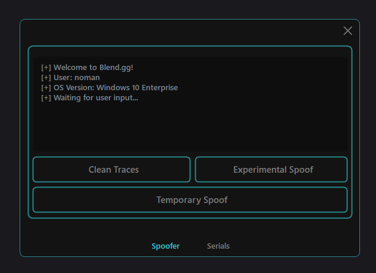

# Blend.gg-Temp-Spoof
Self leak of a basic free temp spoofer with a GUI, 2 spoofing methods, cleaner, and a built in serial checker with saving.
I originally made this as a small project to make a working temp spoofer and release it under a provider name, but lost all motivation for that so now here it is on my github!

